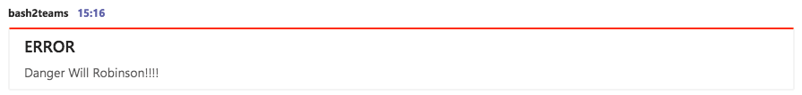

# bash2teams

This script allows you to push notifications to a Microsoft Teams Channel

 #### Values received by this script:
 - Subject = $1 - Message Subject - hopefully either ERROR or SUCCESS
    * Change message themeColor depending on the subject - green (SUCCESS), red (ERROR), or grey (for everything else)
 - Message = $2 - whatever you want really i.e. "DANGER WILL ROBINSON!!!!"
    * This will accept markdown for all your formatting needs
 - Chanel  = $3 - Channel Webhook URL
 
 ----
 
 ### Example
 
 bash2teams ERROR "Danger Will Robinson!!!!" https://bla.bla.bla/webhook/sdjfbaliuh398rheo
 
 
